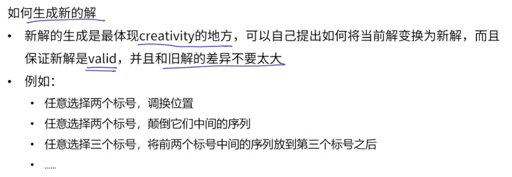
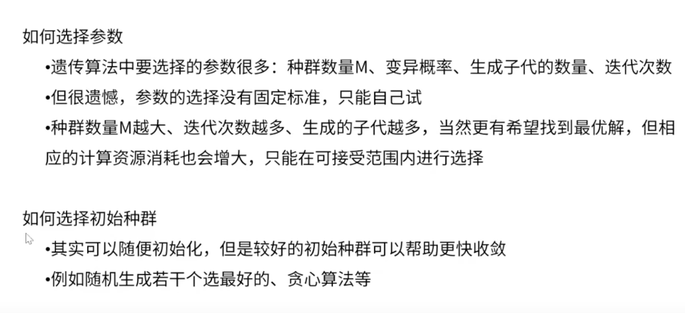
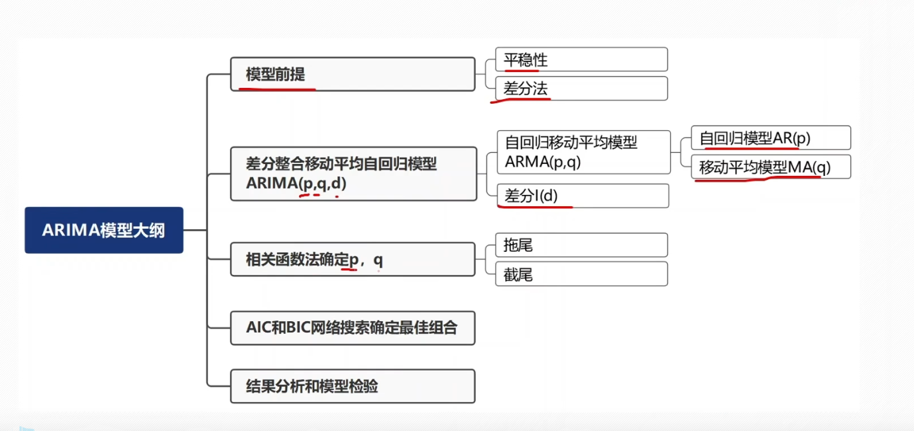

# 数学建模学习
线性规划、非线性规划、动态规划、回归分析、启发式算法。

## 蒙特卡洛法
蒙特卡洛（Monte Carlo）方法算是**随机模拟类算法**，严格来说，它不属于“优化算法”或“精确求解算法”中的某一种，而是一大类基于**概率**与**随机数**的数值计算方法。       
### 核心思想
>用大量随机实验的结果去逼近问题的真实答案.    

进一步解释，如果一个问题的解可以写成某个数学期望（平均值）的形式，那么我们就可以用随机样本的平均值来估计它。样本数越多，估计就越准确。
### 算法流程
以求解 π 为例：    
1. 在一个边长为 2 的正方形中随机撒点（x, y）。
2. 判断这些点落在圆的四分之一扇形里还是外面。
扇形面积 / 正方形面积 ≈ π/4→ 通过落点比例计算 π。
### 适用场景
1. 解析解太复杂甚至没有解析解
- 高维积分
- 多维概率分布求期望
- 非规则几何体面积/体积计算
2. 输入带有不确定性
- 金融风险评估（股票价格波动模拟）
- 工程可靠性分析（材料寿命分布）
3. 复杂系统的模拟
- 粒子运动轨迹
- 辐射传播
- 疫情扩散模拟
4. 优化问题的近似解（和**启发式算法**结合）
- 蒙特卡洛树搜索（围棋 AI、路径规划）
### 优缺点
#### 优点
- 通用性极强（能算的东西很多）
- 编程实现简单
- 高维问题依然有效（不像传统数值积分那样在高维度失效）
#### 缺点
- 收敛速度慢（精度 ~ 样本数的平方根）    
- 有随机性，不同运行可能有轻微差异    
- 精确计算需要大量计算资源     
  
## 启发类算法
**引例**：
旅行商问题：寻求从出发点出发，经过所有目标点，最终返回初始位置的最短路径。      
（属于NP难问题）  
**初步解决方案**：
1. 贪心算法（只有在特定情况下才一定得到最优解，但是至少不会太离谱）。
2. 暴力求解：枚举全部可能结果。
>旅行商问题只可以全部枚举找到最优解。

如果有N个城市，那么该问题需要枚举（n-1）!种不同情况。

### 启发式算法基本知识
1. 概念：基于直观或者经验构造的算法，在可接受的计算时间和空间内解决优化问题的一个可行解。    
2. 他并不保证最优解，只是在优先资源下找到还不错的解。
3. 求NP-hard组合优化问题的全局最优解。
4. **包括**：模拟退火、遗传算法、蚁群算法、神经网络等。
### 模拟退火算法
统计力学表明材料中粒子的不同结构对应粒子的不同的能量水平。   
从高温开始，非常缓慢的降温(称为**退火**)，粒子就可以在每一个温度下达到热平衡。完全冷却后形成低能状态的晶体.
#### 引申的思想
为了不被**局部最优解**困住,需要以一定概率跳出当前位置,接受一个不太好的解.在搜索最优解的过程中不断降温,初期跳出来概率比较大,进行广泛搜索;后期跳出的概率比较小,尽量收敛到较优解.
#### 步骤
1. 随机生成一个初始解X,设定一个初始温度T;
2. 在上一次解的基础上进行调整,生成新的X',并对比旧解f(X):       
   - 如果新解更好,接受;      
   - 新解更差;e^-[f(x')-f(x)]/T 的概率接受.
3. 降温并重复上述步骤,直到迭代一定的次数.

**降温的方法**
     
初始温度为什么这么取,初始解为什么用这种方法?   需要解决.    

### 遗传算法
元素要略微多一些;基于自然选择,自然界优胜劣汰的机制.     

遗传算法通过群体搜索技术，根据适者生存的迭代进化，最终得到准最优解。     
**操作**：
初始群体的产生、求每一个个体的适应度、根据适者生存的原则选择优良个体、被选出的优良个体两两配对，通过随机交叉其染色体的基因并随机变异某些基因产生下一代，按此方法使群体逐代进化，直到满足进化终止条件。

#### 步骤
- 产生M个初始解，构成初始种群。     
- 每对父母以一定概率生成一个新解（交配产生后代）    
- 每个个体以一定概率发生突变。（将自己的解变换成新解）    
- 父代和子代合在一起，留下M个最好的个体进入下一轮，其余淘汰      
- 重复迭代，输出最好的个体。      
  

### 蚁群算法
来自于贸易寻找食物发现路径的行为。蚂蚁分泌信息素，之间相互独立，彼此之间通过信息素进行交流，从而实现群体行为。     
蚂蚁在觅食的过程中会感知这种物质的强度，并指导自己的行为方向，他们总会朝着浓度高的方向前进。    
**正反馈过程** 经过蚂蚁越多，信息素留下的就越多。浓度越高，更多蚂蚁选择这条路。    
#### 步骤
1. 选择蚂蚁数量，每个蚂蚁随机选择一个起点，初始化所有路线上信息素的浓度相等。     
2. 每一个蚂蚁从不同顶点出发，依次选择自己的路径。
   - 在么一个节点处，根据路径本身信息a和信息素浓度b选择下一个节点。    
   - 选择每一个节点的概率正比于a^c*b^d
3. 选择自己路径后，在被选择路径上留下信息素Δb=Q/路径长       
4. 每一轮信息素以一定比例挥发，更新信息素浓度b=ρb+Δb       
5. 重复以上迭代若干次，输出找到最优的解。   
#### 非常适配于找路问题。  

## 时间序列模型（ARIMA）
**时间序列**：也叫动态序列，指的是将某种现象的指标爱找时间顺序排列而成的数值序列。
可分为三大部分：
- 描述过去、分析规律、预测未来。     
**时间序列数据**：对同一对象在不同时间连续观察所取得的数据，它具备两个要素： 时间要素和数值要素。
like:中国历年GDP的数据。
   分类：
   - 时期时间序列: 数值要素反映现象在一定时期发展的结果  。     
   - 时点时间序列：数值要素反映现象在一定时点上的瞬时水平。     
时期可以累加，时点不可以。 
ARIMA(差分整合移动平均自回归模型)

### AR（p）(自回归模型)
描述当前值和历史值之间的关系，用变量自身的历史数据对自身进行预测，其必须要满足平稳性要求。       
只适用于预测**与自身前期相关**的现象。 

### 移动平均模型MA(q)
关注的是自回归模型中误差项的累计。      
移动平均模型（MA模型）是时间序列分析中的一种模型，它描述的是当前时间点的数据与**过去噪声**的关系。严格定义上来讲：其模型的定义是基于白噪声序列的假设。白噪声是一种特殊的时间序列模型，每个时间点的数据都是独立且服从相同分布的，且具有常数的均值和方差。       
- MA模型的基本思想是：大部分时候时间序列应当是相对稳定的。在稳定的基础上，每个时间点上的标签值受过去一段时间内、不可预料的各种偶然事件影响而波动.     
- 即在一段时间内，时间序列应该是围绕着某个均值上下波动的序列，时间点上的标签值会围绕着某个均值移动，因此模型才被称为“移动平均模型 Moving Average Model”

我们可以把一个时间序列看作是过去若干期噪声的加权平均，即当前的观察值是由过去的白噪声通过一定的线性组合得到的。      
  
AR模型是使用过去的实际值进行预测，而MA模型是使用**过去的预测误差**进行预测。即在实际计算时，MA模型规定 e等同于模型的预测值 与真实标签之间的差值（Residuals）；      

移动平均法可以有效消除预测中的随机波动。  
### 自回归移动平均模型ARMA(p,q)
自回归和移动平均的结合。    

该式子表明：
- 一个随机时间序列可以通过一个自回归移动平均模型来表示，即该序列可以由其**自身的过去或滞后值**以及**随机扰动项**来解释。     
- 如果该序列是是平稳的，即他的行为不会随着时间的推移而变化，那么我们就可以通过该序列过去的行为来预测未来。 
>**行为**指的就是变化规律。
### ARIMA（p,d,q）
将AR、MA以及差分法（d）结合，我们就得到了差分自回归移动平均模型ARIMA(p,d,q)

### 建模步骤

模型检验，通过检验之后就可以进行预测了。